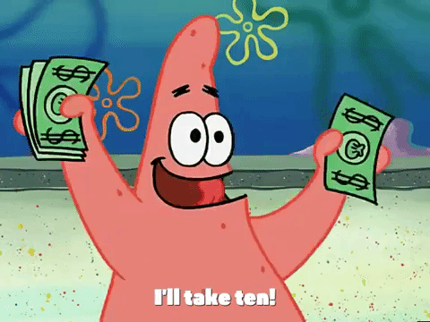
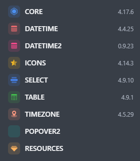
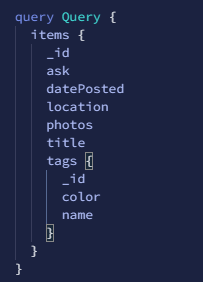
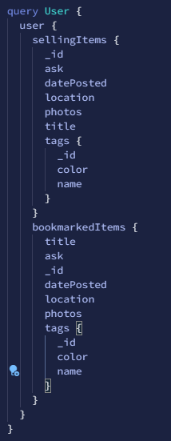

# Stop-N-Shop <!--fit -->

## A shopping platform for finding items nearby <!--fit -->

                      By: Ian Senne, John Ho, and Michael Reyna

---

# Meet The Team <!-- fit -->

---

# Ian Senne <!-- fit -->

- Typescript Tinkerer
- Full Stack Developer
- Loves to learn new things

---

# John Ho <!-- fit -->

- Full Stack Developer
- Disc Golfer
- Weight Lifter

---

# Michael Reyna <!-- fit -->

- Coder
- Piano Player
- Snowboarder

---

# What Is Stop-N-Shop? <!-- fit -->

- Merketplace to Buy and Sell items
- Integrated Chat

---

# Motivation <!-- fit -->

- Wanted to build a website to allow users to buy and sell items.
- Give users direct contact to other users on the site with a chat feature to discuss terms.
- Give users access to the location of an item.
---

# Team Practices and Workflow <!-- fit -->
- Utilized branching
- Timely responses to messages 
- Daily standups to discuss plans and goals
<!-- TODO: need to change standups -->
---

# Branching and Pull Requests <!-- fit -->
- Created Branches for specific features
- Made sure pull requests were reviewed and merged within a reasonable time frame
---

# Yarn<!-- fit -->
- Package manager replacement for npm
- Faster installs

---

<!-- TODO: Expand on this and go into what is a component library. -->
# Blueprint JS<!-- fit -->
- React-based UI toolkit
- Import components

---

# Blueprint Core<!-- fit -->

- Card, Button, and Elevation

---

# Blueprint Core<!-- fit -->

- Extensive List of Icons
- Icons Used in the Navbar

---

# Blueprint Core<!-- fit -->

- Navbar Component

---
# Home Page<!-- fit -->
- As a User I want to see all listed items on the home page.

---

# Profile Page<!-- fit --> 
- As a User I want to be able to see the Items I am selling and the Items I have bookmarked on my Profile.

---

# Create Item Form<!-- fit -->
- As a User I want to be able to create a listing for an item that includes a title, asking price, location, pictures, 

---
<!-- TODO: Expand on this as a technology -->
# SASS<!-- fit -->
 - CSS with superpowers
 - Used nested styles
 
---
# Chat Feature<!-- fit -->
- As a user I want to be able to chat with other members on the site to potentially find a buyer/seller, to negotiate, etc
---

# Search Feature<!-- fit -->
 - As a user I want to be able to search for an item.
---

# Future Development<!-- fit -->
- Filters 
- Direct Messages 

---
# Demo<!-- fit -->

---

# Questions? <!-- fit -->

<!-- TODO: Global: More of a story, Ex. Use wireframe as a starting point for what happened due to the wireframe. -->
<!-- TODO: How do the slides fit into the larger picture. -->

<!-- TODO:  -->